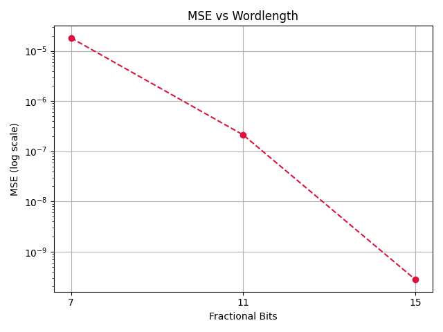
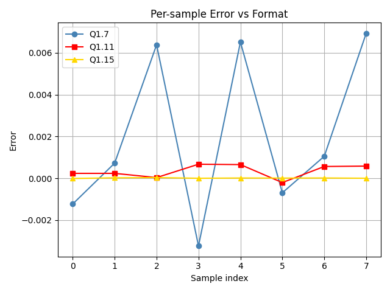

# Fixed-Point-Q1.15-FIR-Filter-in-C-with-Validation
This project implements a fixed point 8-tap FIR filter (Q1.15 format) with PE (Processing Element) abstraction in C with error checking and rounding 

## Why fixed point instead of floating point?
In DSP and embedded systems where complexity and lower power consumption is necessary, a complex FPU (Floating Point Unit) often increases the complexity and reduces performance.
Thus, implementing a fixed point model is best suitable as it has lesser complexity and error within quantization limits of Q format chosen

## Implementation
- Takes floating point inputs and converts into Q1.15 fixed point integer
- Computes y[n] values and converts back into floating point values
- Error checking of the y[n] values from converted values v/s exact values using floating point values
- Calculation of Mean Square Error (MSE) from the error

## Key concepts
- x[n] & h[n] values originally floating point but then are converted into Q1.15 fixed point integer format
- Conversion is done using the logic round(value * ((1<<15)-1)). The 2^15 is implemented as 1<<15 for bit-accuracy
- Bit growth of the accumulator = Q1.15 * Q1.15 = Q2.30
- Q2.30 is scaled down to Q1.15 using shifting (>>15)
- This Q1.15 is converted back to floating point values using /(1<<15) (i.e dividing by 2^15)
- Calculation of error using formula error = y_approx (from fixed point) - y_exact(from floating point values)

## Details 
- x[8] floating point values from <stdlib.h> using rand() function and values lie between [-1,1) (achieved through scaling as (float)rand()/RAND_MAX * 2.0 - 1.0)
- The coefficients are generated using scipy library in python with a hamming window with cutoff of 0.3 normalized frequency 
- Fixed point conversion is done as (value * (1<<15)) to Q1.15 format 
- Rounding is done using round() function and then typecasting to "int" data type
- Processing Element does these operations - multiply then rounding to convert to Q1.15 from Q2.30 then accumulate
- Accumulator maintains the fixed point integer value and is then converted to float from Q1.15

## Results
- The coefficient values generated using scipy library are - [-0.00131688, 0.02637484, 0.15577481, 0.31916723, 0.31916723,  0.15577481, 0.02637484, -0.00131688]
- The shifted values of x[n] across the 8 cycles, the final y[n] values and the MSE value are as shown below :

  

  
  

- The plots of MSE vs fractional bits and per sample error vs format are shown below:

  
  

  
  
  

## Future Work
- Extend to hardware implementation in Verilog

